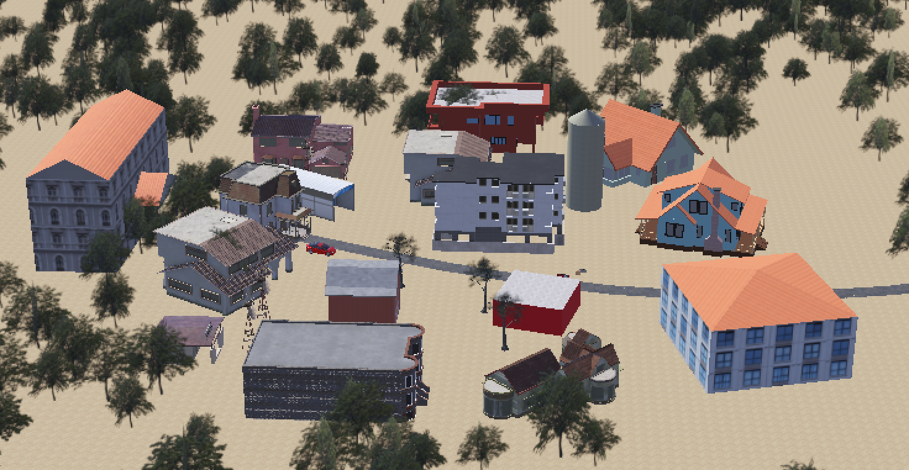
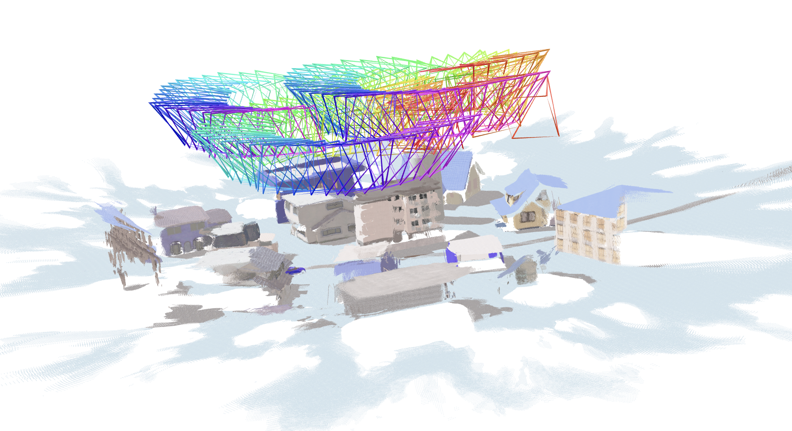
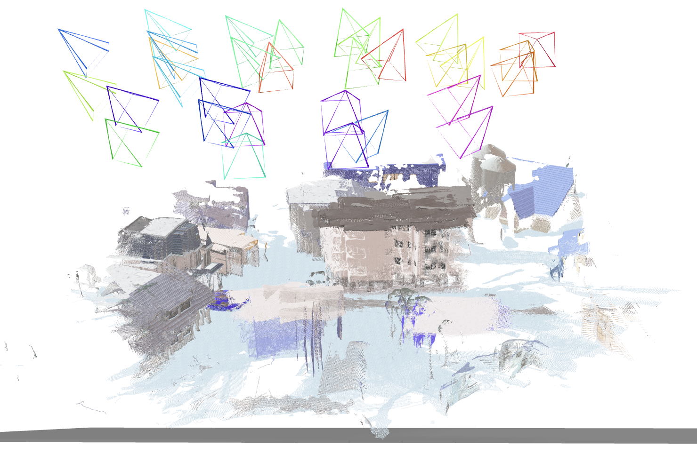

# Autonomous Drone Mapping — AWS Mission Autonomy Hackathon (Vanderbilt University)

This repository contains our project for the **AWS Mission Autonomy Hackathon at Vanderbilt University**.

**Contributors**
- Matthew Hu — [matthew.f.hu@vanderbilt.edu](mailto:matthew.f.hu@vanderbilt.edu)
- Fletcher Glass — [fletcher.d.glass@vanderbilt.edu](mailto:fletcher.d.glass@vanderbilt.edu)
- Alex Guo — [alexander.k.guo@vanderbilt.edu](mailto:alexander.k.guo@vanderbilt.edu)
- Thomas Hung — [thomas.j.hung@vanderbilt.edu](mailto:thomas.j.hung@vanderbilt.edu)

---

## 🛰️ Project Overview

Our project explores how **autonomous drones** can be used to capture images of **hostile or disaster-stricken environments** and reconstruct them into **3D maps** for situational awareness and planning.

To simulate this workflow, we used:
- **Webots** — for drone flight simulation  
- **VGGT** — for generating 3D reconstructions from the captured images

---

## 🧭 System Design

The simulated environment was divided into multiple **circular regions**, with each drone responsible for one circle.  
A **supervisor node** dynamically distributed these regions among drones. If a drone went down, the supervisor automatically reassigned its region to another drone to ensure full coverage and fault tolerance.

### Simulated City

### Initial 3D Reconstruction Result

---

## ⚙️ Optimization

Initially, drones captured images continuously every few seconds, producing **dense image sets** with heavy overlap.  
While this improved accuracy, **VGGT required over 2 hours** to process them.

To optimize performance, we:
- Reduced captures to **eight key waypoints per circular route**
- Took images **only at each waypoint**, reducing redundancy and computation time  

This trade-off slightly reduced map fidelity but **significantly improved efficiency**.

### Optimized Reconstruction Result

---

## 🚀 Summary

This project demonstrates a scalable approach to:
- Autonomous task allocation among drones  
- Resilient mission handling under failure  
- Efficient 3D reconstruction from minimal image data  

## 🔮 Future Improvements

There are several features we didn’t have time to implement during the hackathon that could greatly enhance the system’s performance and automation:

- **AWS Integration:**  
  Automatically upload captured images to an AWS S3 bucket, trigger VGGT processing in the cloud, and output a `.glb` 3D model file once reconstruction is complete.

- **Camera Position Metadata:**  
  Pass the exact drone camera positions to VGGT during processing to improve both reconstruction speed and 3D accuracy.

- **Enhanced Supervisor Algorithm:**  
  Extend the supervisor’s functionality to handle real-time drone health monitoring. When a drone accepts a task, it is marked as *pending*.  
  If the drone fails to check in after a set period, it is assumed to be down, and the task is automatically reassigned to another available drone.
